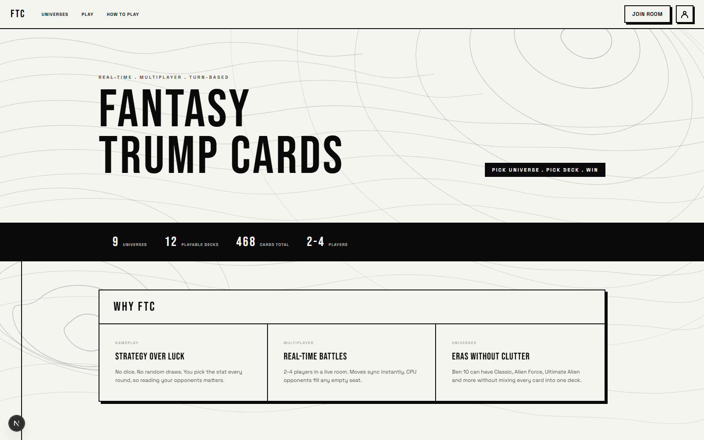
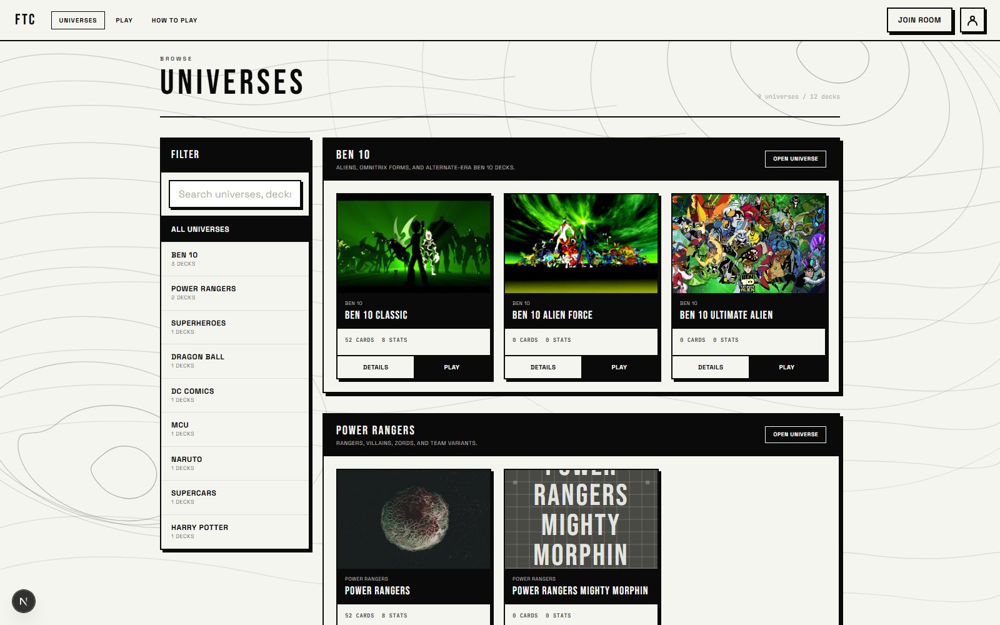
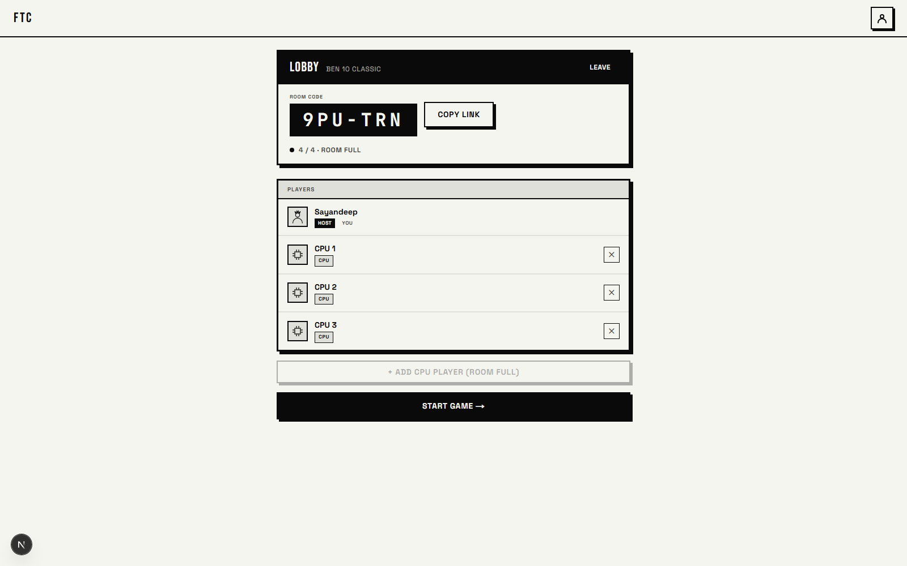
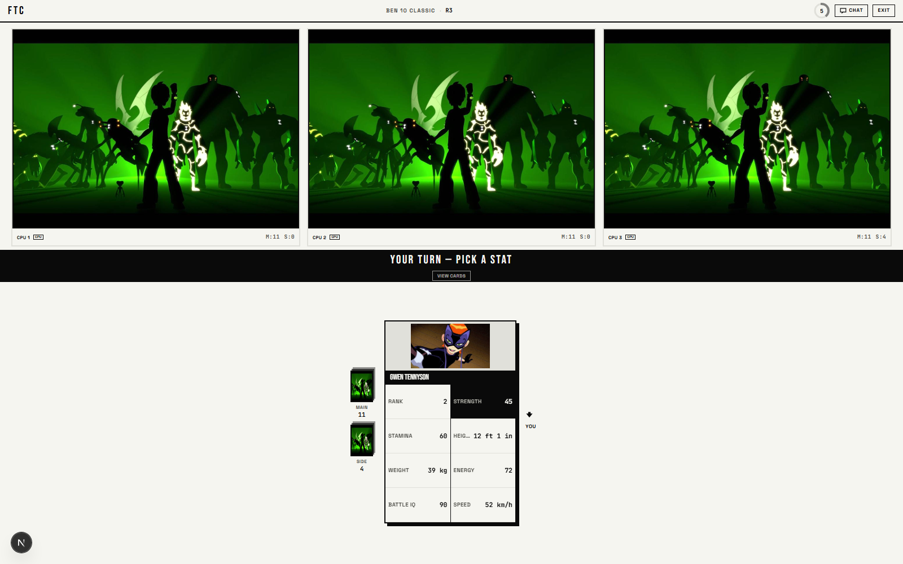

# FTC Game

FTC is a real-time multiplayer fantasy trump card game built with Next.js and Supabase. Players choose a universe, pick a deck inside that universe, create or join a room, and battle by calling the strongest stat on their top card.

Live site: [ftc-game.vercel.app](https://ftc-game.vercel.app)

## Screenshots

| Home | Universe browser |
|---|---|
|  |  |

| Room lobby | Battle — stat pick |
|---|---|
|  |  |

## Features

- Universe-first card selection flow.
- Multiple decks inside each universe.
- Real-time 2-4 player rooms.
- Guest, authenticated, and CPU opponents.
- Top-trumps style stat battles.
- Tie handling, side piles, eliminations, and win state.
- Admin content manager for universes, decks, stats, cards, and images.
- Supabase Storage support for deck covers, universe covers, and card images.
- Deck cover images double as in-game card backs.
- Responsive neo-brutalist interface with Framer Motion and GSAP animation.

## Tech Stack

| Layer | Technology |
| --- | --- |
| Framework | Next.js 15 App Router |
| Language | TypeScript |
| UI | React 19, Tailwind CSS |
| Animation | Framer Motion, GSAP |
| Auth | Supabase Auth |
| Database | Supabase PostgreSQL |
| Realtime | Supabase Realtime |
| Storage | Supabase Storage |
| Deployment | Vercel |

## Project Structure

```txt
app/              Next.js routes and API endpoints
components/       UI, game, deck, room, and homepage components
hooks/            Client hooks for session, room, and game state
lib/              Supabase clients, game utilities, data loaders, image helpers
supabase/         SQL migrations and seed scripts
types/            Shared TypeScript types
Screenshots/      README screenshots
```

## Local Setup

1. Install dependencies.

```bash
npm install
```

2. Create `.env.local` from `.env.example`.

```bash
cp .env.example .env.local
```

3. Fill in Supabase values in `.env.local`.

```env
NEXT_PUBLIC_SUPABASE_URL=
NEXT_PUBLIC_SUPABASE_ANON_KEY=
SUPABASE_SERVICE_ROLE_KEY=
SUPABASE_DB_HOST=
SUPABASE_DB_USER=
SUPABASE_DB_PASSWORD=
NEXT_PUBLIC_APP_URL=http://localhost:3000
```

4. Run migrations.

```bash
npm run db:migrate
```

5. Start the dev server.

```bash
npm run dev
```

Open [http://localhost:3000](http://localhost:3000).

## Scripts

```bash
npm run dev        # Start local dev server
npm run build      # Build for production
npm run start      # Start production build
npm run db:migrate # Run Supabase migrations
npm run db:seed    # Seed database content
```

## Database

The Supabase schema is managed through SQL migrations in `supabase/migrations`.

Current migrations include:

- `001_initial_schema.sql`
- `002_fix_profile_trigger.sql`
- `003_game_columns.sql`
- `004_universes.sql`

The universe migration adds the universe layer above decks, assigns decks to universes, and keeps a fallback path for older deck-only data.

## Admin Workflow

The admin panel lets maintainers:

- Create and edit universes.
- Upload universe cover images.
- Create decks inside universes.
- Upload deck cover images.
- Add and edit stat definitions.
- Add cards manually or import cards by CSV.
- Upload card images.
- Activate or hide universes and decks.

Decks should have 52 cards, 8 stats, complete card stat values, and a cover image before being made playable.

## Game Flow

1. Choose a universe.
2. Choose a deck inside that universe.
3. Create or join a room.
4. Fill the room with players or CPU opponents.
5. The active player calls a stat.
6. The server compares top cards and resolves the round.
7. The winner collects the pile.
8. The last remaining player wins.

## Deployment Notes

The app is designed for Vercel deployment. Add the Supabase environment variables from `.env.example` to the Vercel project settings.

Image uploads use Supabase Storage. Large admin uploads are compressed in the browser before being sent to API routes so they stay within Vercel request limits.

## License

Private project.
